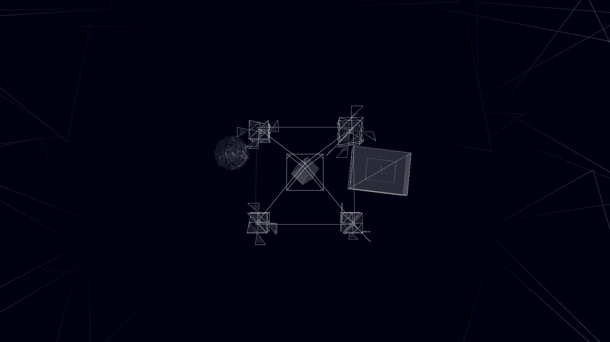

# Architecture Dashboard (3D)

A real-time 3D visualisation of an abstracted AI agent assisted workflow architecture — service nodes
rendered as glowing, translucent "ice crystal" geometries floating in fog,
with soft shadows, ACES tone-mapping, and free orbit/zoom. Three.js loaded
from CDN; otherwise vanilla JS + CSS, no build step.

<p>
  
  
  
</p>

## Viewing it

**Live demo**

**<https://earlyprototype.github.io/crucible-demoscene/architecture-dashboard/>**

Drag to rotate, scroll to zoom, click to focus on a node.

**Running it locally:**

1. Download the **whole repository** (green **Code** button → **Download ZIP**, then unzip) or `git clone` it. 
2. Open a terminal **inside the `architecture-dashboard/` folder** and start any static server:

   ```bash
   python -m http.server 8080
   ```

3. Open <http://localhost:8080> in your browser.

## Original context

This was originally one of two views in a live ops dashboard that was stylised.
