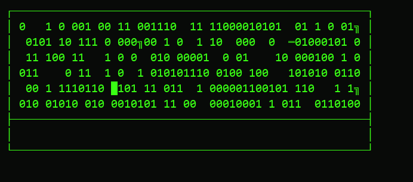

# Cortex Boot Sequence

A themed terminal animation trilogy for "Cortex," the memory/reasoning
module of Project Crucible v0.7. Pure Python standard library — no
dependencies.



## The three pieces

- **`cortex_intro_animation.py`** — green **CORTEX** logo. A "pixel dissolve":
  binary noise (`0`/`1`) resolves into the block-letter logo pixel by pixel,
  holds for a "sizzle" of residual static, wipes clean top to bottom, then
  types out "AI Knowledge Injection Protocol" word by word.
- **`cortex_startup_animation.py`** — blue boot sequence, `░▒▓` shading,
  "INITIALIZING CORTEX FRAMEWORK" / "LLM NEURAL PATHWAYS ACTIVATING."
- **`cortex_outro_animation.py`** — red shutdown, same dissolve technique,
  ending on "CONNECTION TERMINATED."

## Running it

Needs a real terminal with ANSI color support (won't render right piped
through something that strips escape codes):

```bash
python cortex_intro_animation.py
python cortex_startup_animation.py
python cortex_outro_animation.py
```

## How the effect works

Each script builds a list of `(row, col, character)` for every non-space
pixel in the ASCII art, shuffles it, and reveals a batch per frame — so the
logo resolves in a random scatter rather than a scan line. Unrevealed cells
are filled with random `0`/`1` noise each frame, which is what sells the
"dissolving out of static" look.

`demo.gif` was rendered by replaying that exact algorithm frame-by-frame into
images instead of a live terminal — not a separate mockup.
